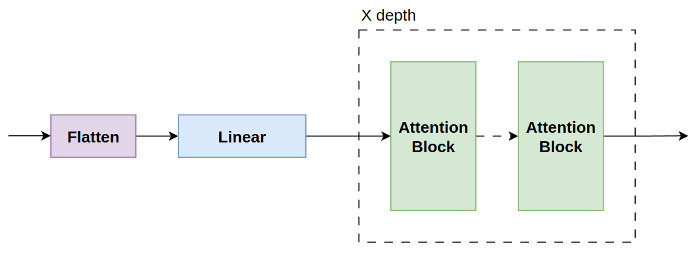
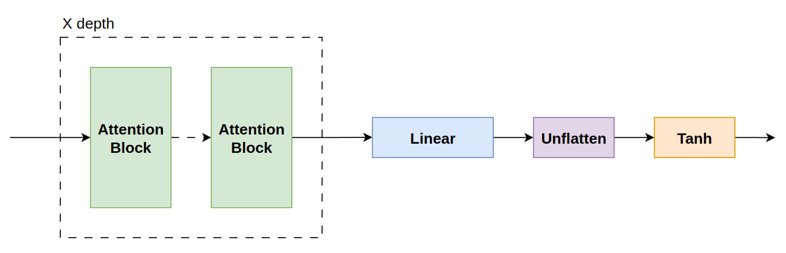
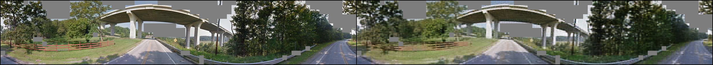
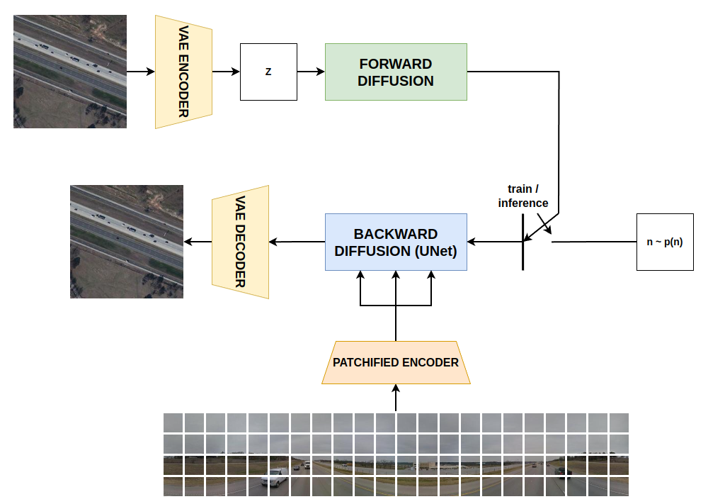

# Ground to Aerial Image Translation
#### Daniele Santino Cardullo - 2127806

## Problem Description
Ground to Aerial Image Translation is an image-to-image translation task with various uses both in industry and research. In particular a non exhaustive list of possible domain of application is:
- Robotics, in particular mobile robotics;
- Autonomous driving cars;
- Geolocalization from images.

Hence finding solutions to tackle this task is useful.

The majority of existing approaches to this problem involve the use of GANs for image translation, despite the obtained results these approaches suffers from the limits imposed by the architecture: difficulty and instability during training and difficulty in controlling the generation during inference. 

To try to overcome these limitations, this project focuses on the implementation of a latent diffusion model to solve the task.

## Implemented Architecture
### Streetview Images Autoencoder
The approach taken to encode the streetview images is to use a masked autoencoder but with a modified training phase and structure with the one described in [1]. In this implementation of the autoencoder both the encoder and the decoder have same dimensionality, and uses a ViT like structure. During training phase the model is fed with a portion of the patches, based on their semantics; during inference the input is the complete patched image.



The above encoder structure is formed by a flatten operation on patches, which are later linearly embedded. Finally the flattened and embedded patches go through a series of ViT-like encoders.



The decoder structure is the specular architecture of the encoder, it receives the encoded patches that goes through a series of ViT decoders, then they are unflattened to have the image patch original structure (removing the positional encodings).

Encoder and decoder are combined to create the autoencoder, after training only the encoder part is used to encode the streetview images.

To pretrain the autoencoder it is sufficient to run `python pretrain_patch_autoencoder.py`, to change the hyperparameters and the training variables it is possible to modify `pretrain_patch_config.yaml` file.

After training for 100 epochs the results are $0.015$ loss on validation set:


GT on the left and result on the right.

### Latent Diffusion Model
Latent Diffusion Model (LDM) is a generative architecture based on latent diffusion. In particular it is composed of two parts: PNDM Scheduler for the forward diffusion process; a UNet architecture for the backward diffusion process.

The satellite images are encoded with a variational autoencoder, then noise is step by step added to these latents until they become Gaussian noise, then the UNet objective is:

$$\| \mathcal N - f(\vec z_t, y) \|^2$$

where $\mathcal N$ is the original total noise to add. The UNet denoising process is conditioned on streetview images.


During training the model is trained to learn the added noise at random timesteps, during inference the model is fed with noise and conditioning information, the model predict step by step the total added noise and then it is gradually removed with the scheduler.

### Complete Architecture
The complete architecture is formed by an VAE for encoding satellite images during training step, and decoding the denoised latents in inference; it is also composed by the above described latent diffusion model and the patch autoencoder for conditioning information encoding.



# Run the code
After cloning the repository and downloading the dataset the structure will be:

```
ground_aerial_project/
├── conf/
│   ├── pretrain_patch_config.yaml
│   └── ldm_config.yaml
├── data  /
│   └── CVPR_subset /
├── imgs /
├── source/
│   ├── datasets/
│   │   └── patchified_dataset.py
│   ├── PatchesAE/
│   │   ├── attention.py
│   │   ├── autoencoder.py
│   │   ├── decoder.py
│   │   └── encoder.py
│   └── ldm/
│       └── ldm.py
├── .gitignore
├── LICENSE
├── pretrain_patch_autoencoder.py
├── pretrain_ldm.py
├── generate_satellite.py
├── requirements.txt
└── README.md
```

To run the code it is suggested to create a virtual environment and install the dependencies listed in `requirements.txt`.

# Reference
[1] Masked Autoencoders Are Scalable Vision Learners - K. He, et al. (https://arxiv.org/abs/2111.06377)

